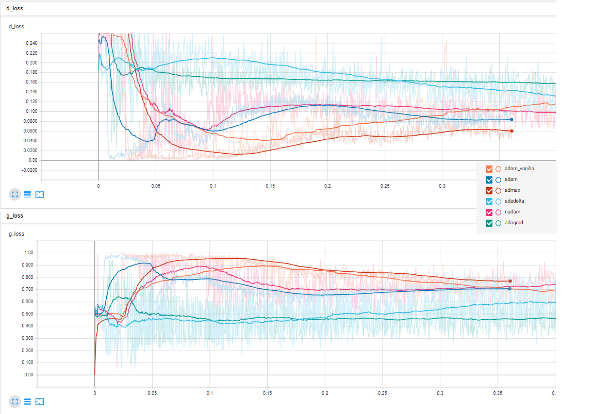
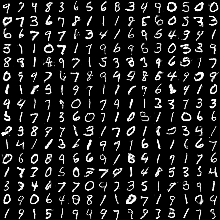

# DCGAN
implementation of Deep Convolutional Generative Adversarial Network with Keras.
The approach flows from this [**paper**](https://arxiv.org/pdf/1511.06434.pdf).

### Requirement 

tensorboard_logger : for logging directly on tensorboard [tensorboard_logger](https://pypi.org/project/tensorboard_logger)

**pip install tensorboard_logger**

The same model was trained several times with the same configuration on the MNIST dataset.
batch size = 256
nb epoch = 25 

i just changed the optimizers and tested many ones.
The optimizer's parameters taken directly from [Keras source](https://keras.io/optimizers/).

for every trained model i logged both generator and discriminator loss on tensor board.

i plot here the **best** images generated by the model.

### Adadelta

### Adagrad

